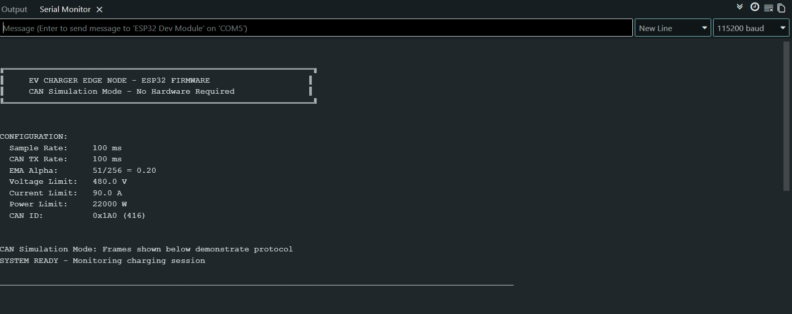
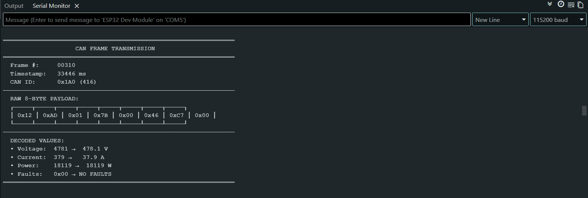
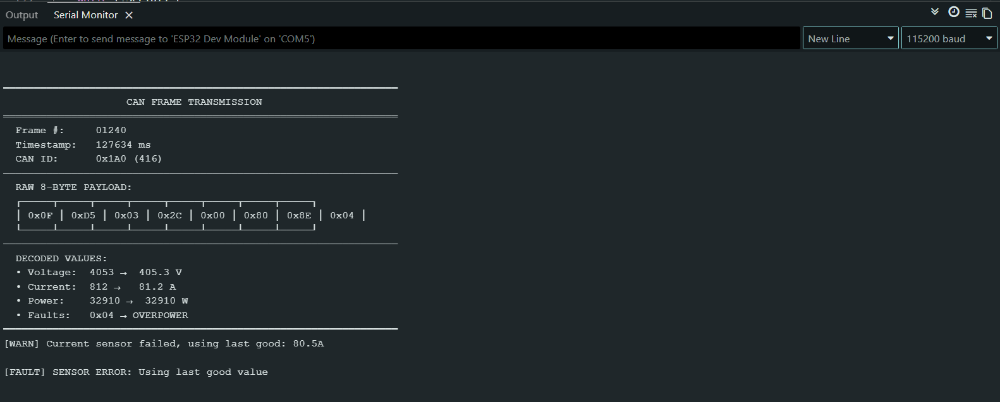
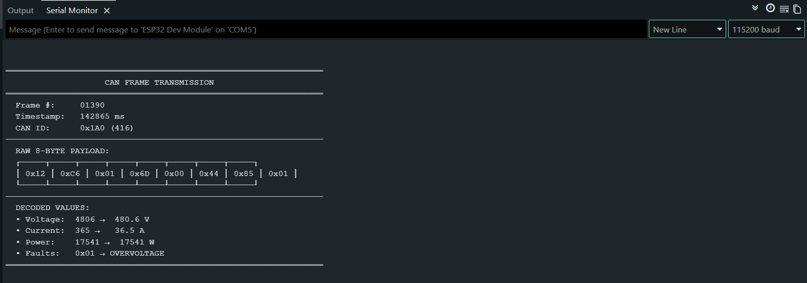
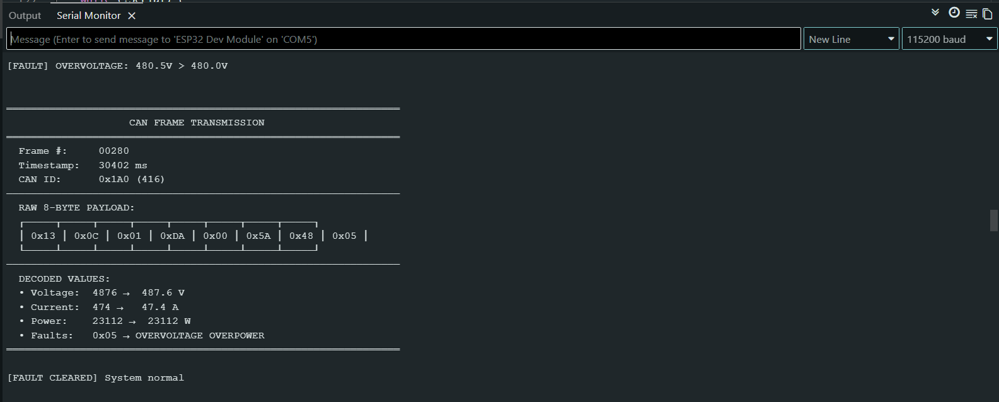

# EV Charger Edge Node Firmware

# Author: Rakesh Bharathi S

## Overview

This project implements firmware for an EV Charger Edge Node running on an ESP32. The firmware simulates voltage and current measurements from an active EV charging session, filters noisy readings, calculates power, detects fault conditions, and generates CAN-formatted telemetry frames.

The generated CAN frames are displayed through UART output for verification and analysis, allowing the project to be evaluated without requiring external CAN hardware.

This project was developed as part of the Fluxton Embedded Engineer Take-Home Assessment.

---

## Platform

* Microcontroller: ESP32
* Language: C++ (Arduino Framework)
* Communication: CAN Frame Simulation
* Debug Interface: UART (Serial Monitor)

### Why ESP32?

The ESP32 was selected because it provides sufficient processing capability for real-time monitoring applications and is widely used in embedded systems development. The Arduino framework enables rapid prototyping while maintaining access to low-level functionality when required.

---

## Features

* Simulated voltage sensor (200V–500V)
* Simulated current sensor (0A–100A)
* Synthetic sensor noise generation
* Exponential Moving Average (EMA) filtering
* Instantaneous power calculation
* CAN frame generation and payload packing
* Fault detection and reporting
* UART diagnostics and logging
* Sensor failure handling
* Fixed-rate sampling and transmission scheduling

## Timing Configuration

| Parameter | Value |
|------------|--------|
| Sampling Interval | 100 ms |
| CAN Transmission Interval | 100 ms |
| Display Refresh Interval | 3000 ms |

---

## Data Representation

To improve efficiency, all measurements are stored as scaled integers.

| Signal  | Resolution |
| ------- | ---------- |
| Voltage | 0.1V       |
| Current | 0.1A       |
| Power   | 1W         |

Examples:

* 350.0V → 3500
* 60.0A → 600

---

## CAN Frame Layout

| Byte | Description               |
| ---- | ------------------------- |
| 0–1  | Voltage (0.1V resolution) |
| 2–3  | Current (0.1A resolution) |
| 4–6  | Power (1W resolution)     |
| 7    | Fault Flags               |

### Fault Flags

| Bit | Fault        |
| --- | ------------ |
| 0   | Overvoltage  |
| 1   | Overcurrent  |
| 2   | Overpower    |
| 3   | Sensor Error |

---

## Fault Thresholds

| Condition   | Threshold |
| ----------- | --------- |
| Overvoltage | > 480V    |
| Overcurrent | > 90A     |
| Overpower   | > 22kW    |

---

## Build and Run

1. Install Arduino IDE 2.x
2. Install the ESP32 Board Package
3. Open `EV_Charger_Edge_Node.ino`
4. Select **ESP32 Dev Module**
5. Compile and upload the firmware
6. Open Serial Monitor
7. Set baud rate to **115200**

No additional hardware is required.

---

## Expected Output

The firmware periodically displays:

* Simulated CAN frame data
* Voltage measurements
* Current measurements
* Derived power values
* Fault status information
* Sensor diagnostics

Fault conditions are immediately reported through UART output.

---

## Example Output

### System Startup

### Normal Operation

### Fault Detection

 

### Fault Recovery

---

## Simulation Approach

To keep the project hardware-independent and easy to evaluate, CAN communication is demonstrated through software simulation.

The firmware generates CAN-formatted telemetry frames, packs the required payload fields, and displays the resulting frame structure through UART output. This demonstrates frame construction, payload encoding, transmission scheduling, and fault reporting without requiring a physical CAN transceiver or a second CAN node.

---

## Repository Contents

* Source Code
* Part A Design Document
* README
* Example Output Screenshots

---

## AI Usage Disclosure

AI tools were used during development for:

* Code review - Deepseek & Claude
* Architecture review - Deepseek & Claude
* Documentation assistance - ChatGPT
* Design validation - Deepseek, Claude, ChatGPT

All generated content was reviewed, modified, tested, and validated manually before submission.
